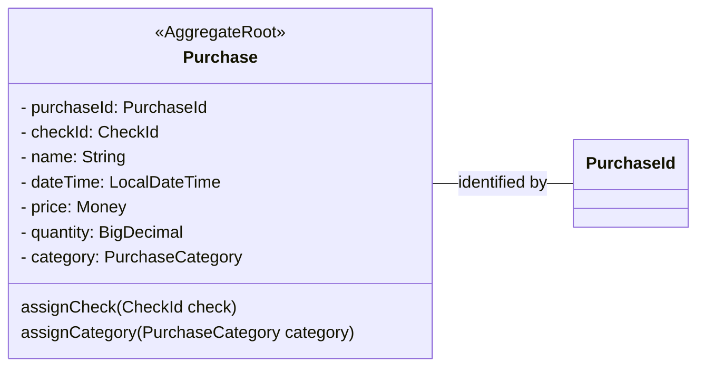

```mermaid
classDiagram
    direction LR
    class Purchase {
        - purchaseId: PurchaseId
        - checkId: CheckId
        - name: String
        - dateTime: LocalDateTime
        - price: Money
        - quantity: BigDecimal
        - category: PurchaseCategory
        assignCheck(CheckId check)
        assignCategory(PurchaseCategory category)
    }
    <<AggregateRoot>> Purchase
    class PurchaseId

    Purchase -- PurchaseId : identified by
```
